# 多功能电子锁设计报告

## 0. 前言

这是一款基于**CT107S**单片机以及**LCD 12864**显示模块的多功能电子锁。您可以通过本设计实现多种**密码匹配模式**的锁定/解锁来确保您的信息安全，同时还兼有**时间显示模块**与**危险报警模块**。

首先，这是本人第一次完整地进行这样的电子设计，因此存在诸多不足，希望用户能够包容，希望报告读者能够批评指正！

本设计中的功能、代码都将在下文展开，此处说一些规范。本设计的代码中原创部分均采用英文注释，并向STC公司提供的代码注释风格进行统一。以"/\*\* Something \*/"的格式**框住注释主体**，同时采用 ***\@keyword***的方式**提示主要信息和解释重要参数**。

e.g.
```cpp
/**

* @breif Here is the introduction to this moduel

* @Author Here is the name of who create this moduel

* @Date Here is the Date when the modeul has been created

* @param It refers to a specified parameter of a function or something

* @member It refers to a specified member of a STRUCT or a CLASS 

*/
```

## 1. 功能设计&板载资源分配

### 1.1 密码解锁模式

本设计采用三种密码解锁方式，分别为**定长密码模式**、**虚位密码模式**、**子串密码模式**。

一. 定长密码模式
-------------------------------------------------
密码**长度固定**，用户的输入需和所设密码**一模一样**才可成功解锁。

***e.g.*** 设密码为**1234**（下同）
--------------------------------------------------------------------------
1) 输入为**1234**
成功解锁！

2) 输入为 **123**
解锁失败！

二. 虚位密码模式
-------------------------------------------------
该模式下用户的有效输入为**正确密码前缀以任意位的其他数字**，检验时倒着检验即可。

*e.g.*
--------------------------------------------------------------------------
1) 输入为**0001234**
成功解锁！

2) 输入为**012341234**
成功解锁！

3) 输入为**0123412340**
解锁失败！

三. 子串密码模式
-------------------------------------------------
该模式下用户的有效输入为**开头不超过两个虚位并以最后一位正确密码结尾，同时任意两个正确密码元素间可以存在不超过两个的任意字符**。检验时采用**动态规划算法**实现。

*e.g.*
--------------------------------------------------------------------------
1) 输入为**00010223454**
成功解锁！

2) 输入为**012341102134**
成功解锁！

3) 输入为**0123411021340**
解锁失败！

4) 输入为**0123412340**
解锁失败！

实现思路——动态规划
-----------------------------------------------------------------------
首先假设函数$Check(i)$代表输入字符串前 ***i*** 个字符中可以成功匹配设定的密码，那么显然有如下递推式：
$$
Check(i) = (input\_stream[i]==lock.password[tail])\&\&(Check(i-1)||Check(i-2)||Check(i-3))
$$
显然，这是一个 ***四变量相关 Four-Variables Related***\ 递推问题，因此采用 ***滚动数组 Scrolling Array*** 的思想进行算法空间优化，即：
$$
\begin{align*}
p&: 当前状态的上上上个状态\\ \\
q&: 当前状态的上上个状态\\ \\
r&: 当前状态的上个状态\\ \\
s&: 当前状态
\end{align*}
$$
则有：
$$
s =  (input\_stream[i]==lock.password[tail])\&\&(p||q||r)
$$
其中 ***i*** 代表当前正在计算的输入字符串下标，***tail*** 代表**正在检验的密码下标**，而每一个密码字符 ***lock.password[i]*** 都有**可能在三个位置出现**，因此**每次计算当前输入字符匹配的对应密码字符的下标是动态的**，同时由于出现位置的可能性，该下标三轮操作更新一次。

同时对于输入字符而言，以三次操作为一个周期，设当前操作为第 ***i*** 次，则每一次判别都应再向后看 ***i*** 个密码字符，由此得到如下检验函数：

```cpp
unsigned char Check(void){

	// Status Variables
	unsigned char xdata p, q, r, s, tail, tail_cnt;
	unsigned char xdata len1, len2;
	unsigned char xdata check_i, check_j;
	len1 = input_point;
	len2 = lock.length;
	p = q = r = s = 1;
	tail =  tail_cnt = 0;
	
	q = (lock.input_stream[0] == lock.password[0])?1:0;
	r = ((lock.input_stream[1] == lock.password[0]) ||\
		(len2>=1?(lock.input_stream[1] == lock.password[1]):1))?1:0;
	s = ((lock.input_stream[2] == lock.password[0]) ||\
		(len2>=1?(lock.input_stream[1] == lock.password[1]):1) ||\
		(len2>=2?(lock.input_stream[2] == lock.password[2]):1))?1:0;
	
	tail++;
	for(check_i = 3; check_i < len1-1; check_i++){
		if(tail>=len2){
			break;
		}
		p = q;
		q = r;
		r = s;
		s = ((lock.input_stream[check_i] == lock.password[tail]))?1:0;
		for(check_j = 1; check_j <= tail_cnt; check_j++){
			s = ((s==1)||(tail+check_j>=len2?1:(lock.input_stream[check_i] == lock.password[tail+check_j])))?1:0;
		}
		if(tail_cnt++==3){
			tail++;
			tail_cnt = 0;
		}
		s = ((s==1)&&(p==1||q==1||r==1))?1:0;
		
	}
	
	s = ((q==1||r==1||s==1)&&(lock.input_stream[len1-1]==lock.password[len2-1]))?1:0;
	return s;
	
}
```

该算法函数的时间复杂度为线性最优的$O(n)$同时空间复杂度为常数级的$O(4)$。

### 1.2 按键区域划分

根据上述的三种上锁密码模式，首先我们需要一个按键用来**设置模式**，其次为了实现有限键盘按钮输入**数字/字母**实现多种字符组合，我们还需要一个按键用来实现**换挡**功能，将数字按键升档到字母区输入字母。（类似于电脑上的 ***CAPS*** 按键用来转换大小写）

最后，常规的密码输入系统都有一个**退格键**和一个**确认键**，综上，我们对板载的矩阵键盘进行了如下的功能定义：
<div align="center"></div>


### 1.3 按键输入处理

本设计采用单点按下读入的方式处理按键事件，即**单次按下并抬起**才算作一次输入。同时，为了方便进行换挡输入字母，本设计还设计了针对 *SHIFT* 键的**长按事件判断**，长按时将进入“长Shift”模式，**此时12个字符输入区按下都将读入其升档后对应的字母**。

流程图如下：
<div align="center">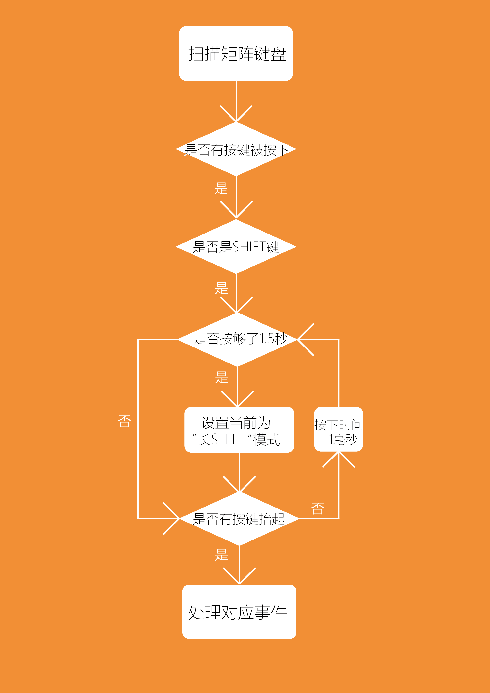</div>

### 1.4 危险行为报警

本设计将危险行为定义为在**两位密码输入之间逗留的时间超过** <font color="red"><b>10s</b></font> 。若检测到输入超过 **10s** ，则电子锁将迅速进入损毁模式。

### 1.5 显示页面

本设计采用**LCD 12864**作为显示硬件，同时采用其**串行模式**进行内容展示。具体来说，使用时需要进行如下接线：

| LCD引脚 | CT107S引脚 | 备注 |
| :----------: | :----------: | :----------: |
| GND | GND | 模块接地端 |
| VCC | VCC | 模块供电端 |
| RS | P1.2 | 片选端（选择显示区域） |
| R/W | P2.0 | 读/写选择端口 |
| E | P2.1 | 使能端口 |
| V0 | VCC | 对比度电压调节端口 |
| BLA | VCC | 背光补偿灯光模块阳极供电端 |
| BLK | GND | 背光补偿灯光模块阴极接地端 |

本设计共有如下几种页面：
1. 锁定页面（默认）
2. 损毁报警页面
3. 错误提示页面
4. 解锁页面
5. 设置页面
7. 密码匹配模式选择页面
8. 密码内容修改页面
9. 时间校准页面

其中，解锁之后可以进行设置，故有如下**树形页面依赖关系**：
<div align="center">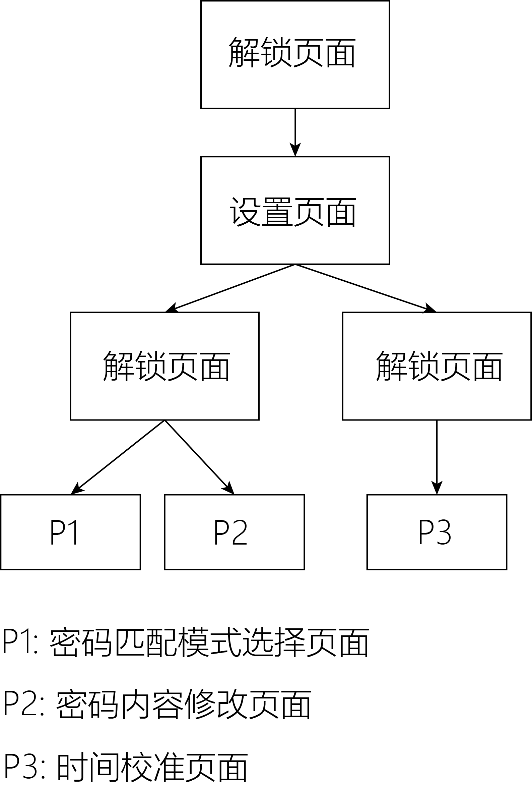</div>

而在页面切换方面，本设计借鉴了电脑/手机软件中常用的**页面栈**设计，即页面的存放可以视为一个栈，每次**打开一个新页面**相当于**将要打开的页面入栈**，而**退回上一个页面**则相当于**弹出当前栈顶页面**。这样一来，当前展示的页面便永远是栈顶页面了，同时可以按照打开顺序一一返回上一页面。
<div align="center">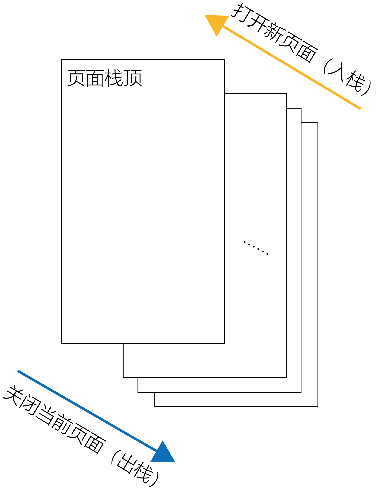</div>

### 1.6 设置功能

在解锁被设计后，可以通过**设置键**进入设置界面。接着按下字符输入区的1/2/3/...等数字按键即可选择对应的设置模式。

下面主要介绍密码的**模式修改**、**内容修改**以及**时间校正**三部分的设计：

**一. 密码匹配模式修改**

进入对应页面后提供三个选项：
1. 普通匹配模式
2. 虚位密码模式
3. 子串实现模式

实现模式修改的逻辑为直接为 ***Lock*** 结构体中的 ***mode*** 成员变量赋予对应模式的值，而这一值会直接影响**锁定模式时确认键按下后**执行的**密码匹配函数**中的匹配方案/算法。

**二. 密码内容修改**

密码内容修改时本设计依旧遵循 **“两遍输入”** 原则，即用户需要在进入密码内容修改时**连续两次输入同样的内容**才可完成设定。

注意：此时的输入过程中**仍保持同解锁输入时一样的危险行为检测**，且修改密码过程中**页面栈**、**重锁按钮**以及**设置按钮**一律锁定以防止逻辑错误。

实现方式为通过两个数组来存储两次的输入，在第二次按下确认后立刻进行输入判定，对比两数组元素来保证**输入的一致性**。完成判定后，若输入不一致，则跳转回第一次设定；否则记录下新密码并直接**伪清空**$^{[1]}$页面栈和**锁定密码锁**。

流程如下图所示：
<div align="center">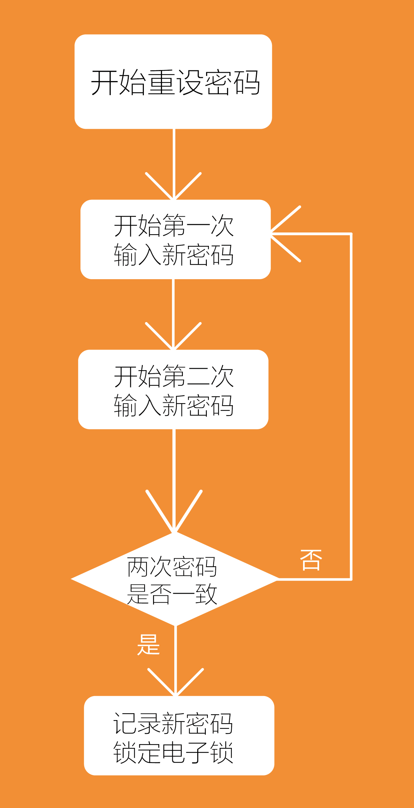</div>

---
[1] 此处的伪清空指的是**将栈顶直接退回初始处**，而不按照$O(n)$复杂度的顺序清空来完成。


**三. 时间校准**

该页面为用户实现了可视化的时间校准功能，为了方便用户进行修改，本设计不再采用最初构思的通过上下调节（对某一量进行加一减一）来校准时间，而是通过**询问式交互**让用户**通过矩阵键盘对时间进行设置**。

具体流程图如下：
<div align="center">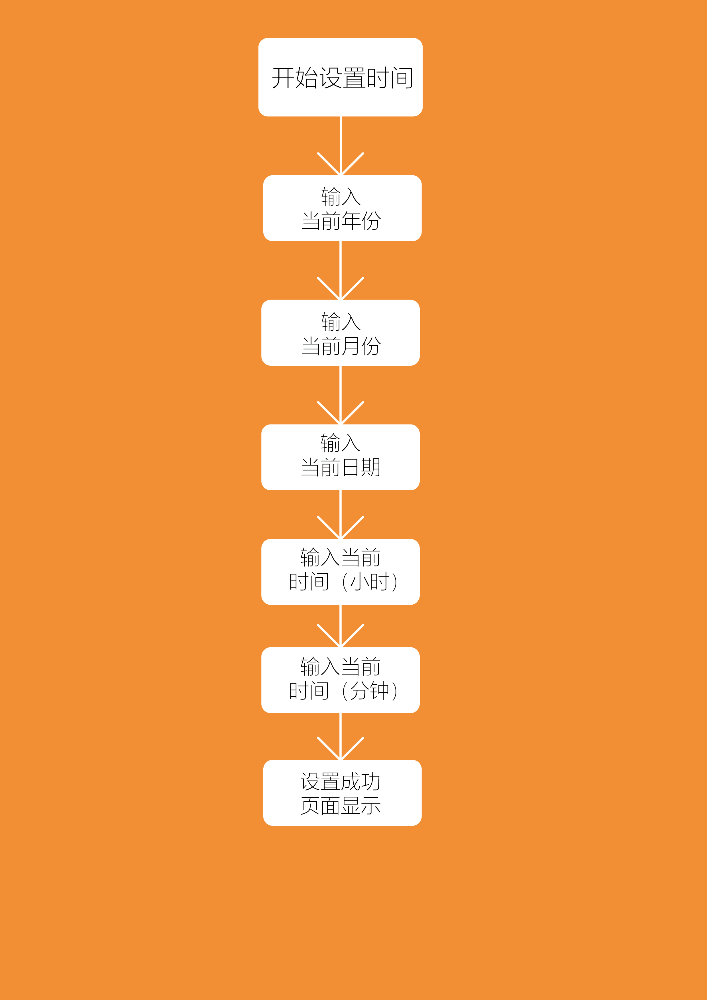</div>

## 2. 程序模块流程图

将上述通过键盘输入响应的各个模块**统称为对键盘输入的响应**，则可得到如下简单明了的大体结构图：
<div align="center">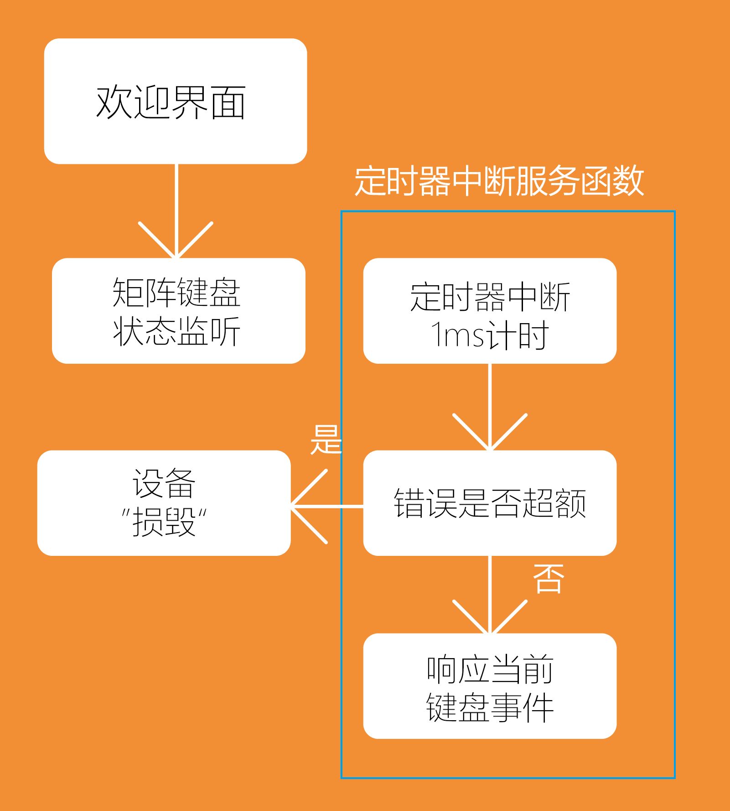</div>

## 3. 实机演示

开机欢迎界面如下：
<div align="center">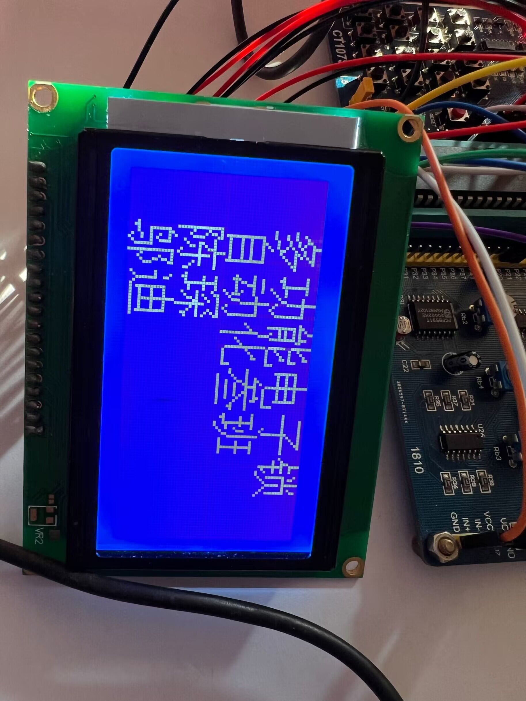</div>

锁定页面如下：
<div align="center">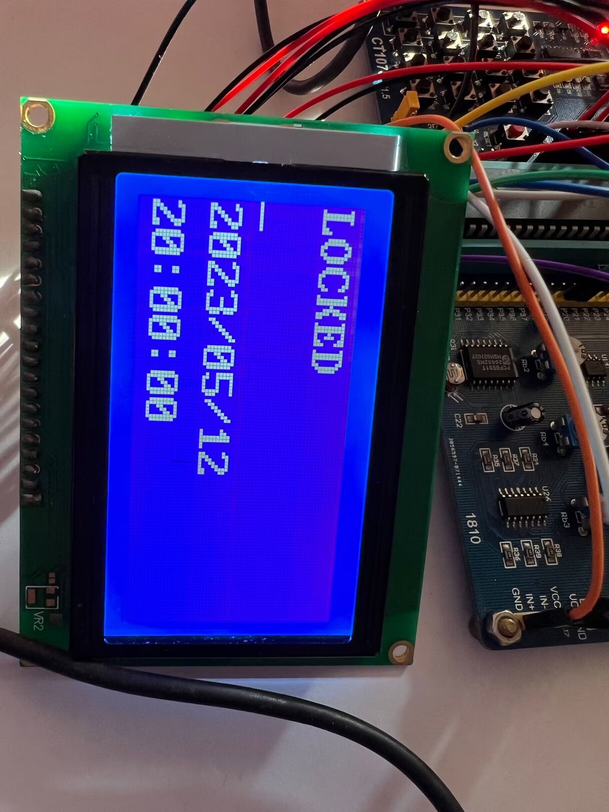</div>

解锁页面如下：
<div align="center">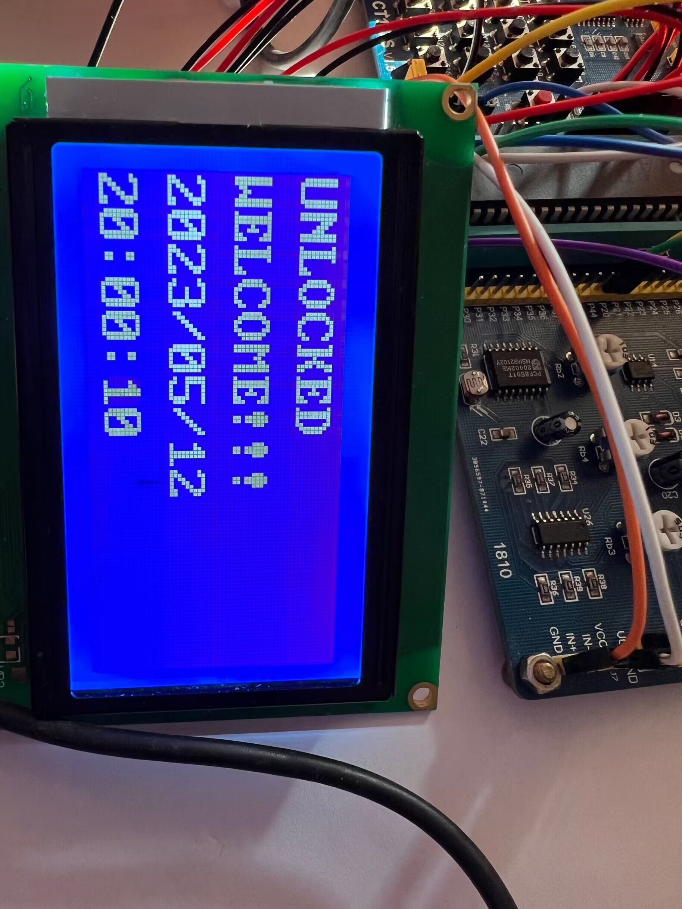</div>

设置页面如下：
<div align="center">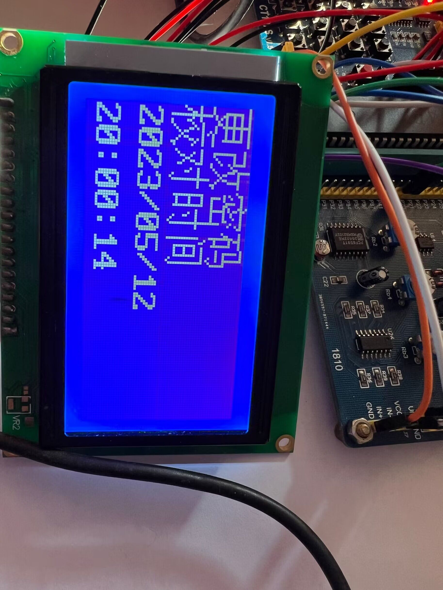</div>

密码设置界面如下：
<div align="center">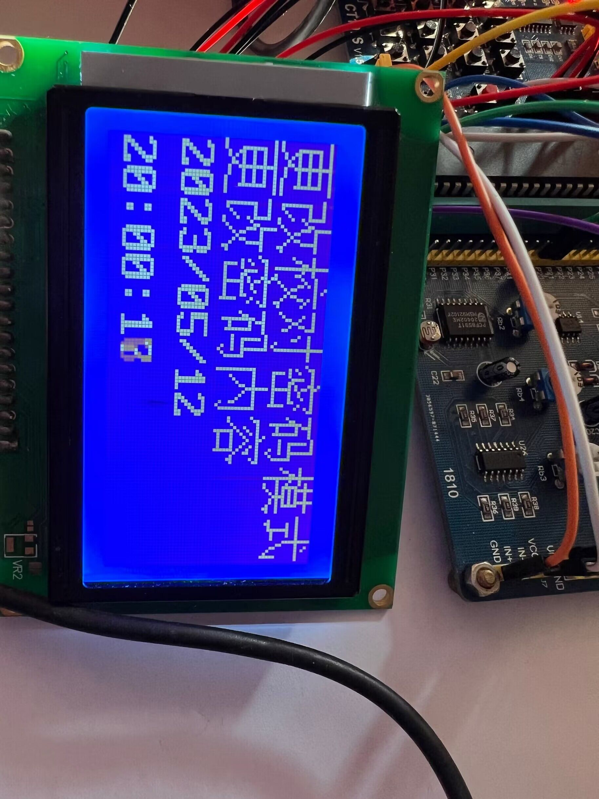</div>

密码匹配模式设置页面如下：
<div align="center">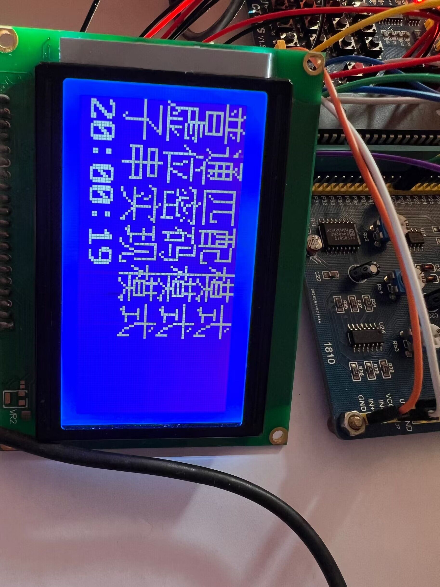</div>

密码内容修改页面如下：
<div align="center">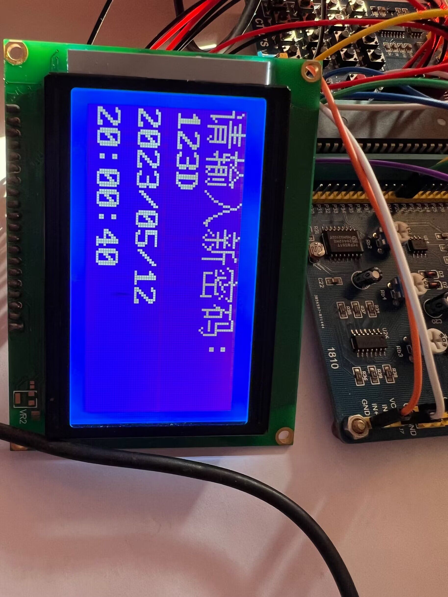</div>

时间校准页面如下：
<div align="center">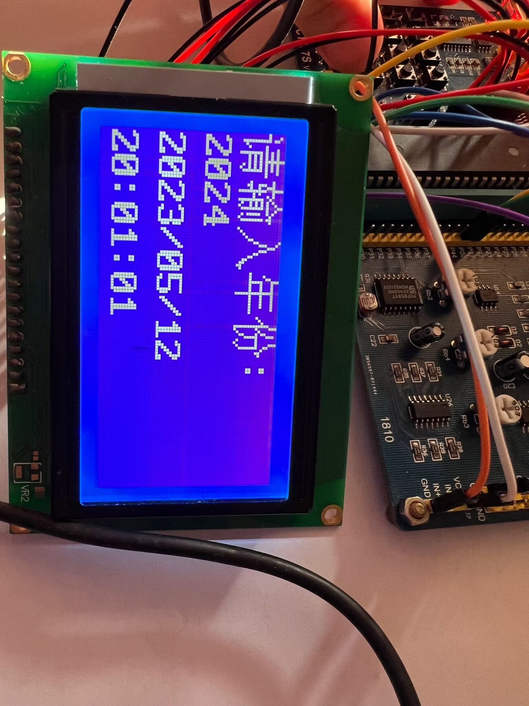</div>

时间校准演示2：
<div align="center">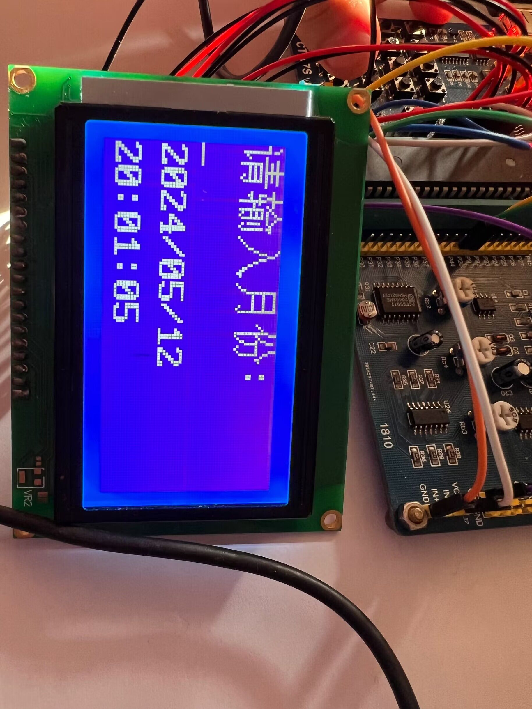</div>

## 4. 个人感想与致谢

在本设计中本人主要担任**功能设计、模块分配、算法设计、代码编写、硬件调试**等工作。

整个设计和实现过程磕磕绊绊，从最初的点灯到折磨了我几个夜晚的点LCD——从一开始的delay函数频率不对齐问题（电赛便遇到过的老毛病）到最后的对比度问题。硬件和代码的联调对我而言就两个字——**折磨**。

我是一个立志做$AI$研究和算法研究的 **特别特别特别“软”** 的自动化学生，这倒也没有那么稀奇了，不过对于天天浸淫在**上位机和服务器的高级算力和存储资源**的我来说，刚上手CT107S便被数据内存分配打了个措手不及。好在STC15F2K60S2的**外部存储空间**还是非常充足的，以至于后来的所有变量我都用了**xdata**进行声明，甚至函数中的临时变量亦是如此。

而这样提心吊胆地用着存储空间的日子也让我深刻反思了不少——在进行算法设计编程时，我们常常讲**空间复杂度优化**，简称**空间优化**。但其实这一优化的对象一般是指**代码中对重复计算数据的大量重复存储**。回看自己在LeetCode、PTA、CSP上刷算法题时的代码，不禁让我后怕——到处都是 ***int*** 、***double*** 等字长很长甚至最长的变量类型声明。生动一点说，就好比如今的我突然回到50年代生活了一段时间。这样质朴与和存储空间勾心斗角的生活教会了我很多很多，比如C51单片机中不能够引用二值变量 ***bool*** ，但可以通过 ***bit*** 直接进行**位声明、位操作**，其实 ***bool*** 本质上也只是一个单独的二进制位。再比如从寄存器的各种标志位信息存储可以学会将多种二值标志位放到**一个字节**中进行存储，然后用**与、或**等逻辑操作进行值的读写。（虽然实际赶工时没有怎么用到，如果时间充足，这方面我是非常希望能下功夫编排和整理的）

存储空间交给我的不仅仅是上面这些，上面只是单片机中**数据存储**的部分，既幸运也不幸的是，我还在程序存储上遇到了大麻烦。当我的代码长度来到2K时，Keil5突然报错说代码长度超限，不允许编译。这吓得我急出一身冷汗，也顺便让我傻到忘记了STC15F2K60S2的程序Flash是有60K的！！！

这时以为是真的代码太长装不下的我开始了疯狂优化代码，从**逻辑合并**到设置里打开**顶级代码优化**，最后努力到不加上时间更新函数能够恰好够着2K的限制。当然最后恍然大悟我有60K空间的时候才回过头解决了Keil5(bushi)，装过了一个C51版本的Keil5并破解后便可以正常编译了。写下这些感想时的我还差时间校准模块的代码没完成，此时的程序存储空间已经使用了6017B，块6K了。

依旧顺着代码长度，这次的设计中非常遗憾的是没有能够很好地进行模块化，后面的很多功能都直接堆进 ***main.c*** 里了，导致其内容有上千行。不过倒也应付的过来，后续有时间的化要好好优化和封装一下。（曾经打电赛时我嫌标准库代码长还疯狂进行了封装，当时做的LED翻页多功能选择模块也封装地非常好，到底还是太自信了，拖到最后才来通宵弄哈哈哈哈哈）

当然，这次也用到了很多很多偏 **“软件”** 的知识，这就比较富有我的个人特色了哈哈哈。从**页面栈**到**动规解算密码**，从**前端架构**到**后端算法**，从**百草园**杀到**三味书屋**，属于是梦幻联动了，我**非常满意和自豪**！！！

说到这里的动态规划又不得不提到给出了诸多宝贵意见的**我的女朋友**——**金统院2019级的程莹同学**，在此特别致谢程莹同学。

她在设计之初便带领我查阅资料文献最终为密码匹配模式提出了两点宝贵意见：
1. 参考阿里、腾讯等龙头企业正使用中的**虚位密码**模式
2. 在其思路上扩展，可以**通过两个正确字符间塞入一些字符来混淆和保护**，同时莹莹提到了当时我学习动规时在力扣上刷到的**子字符串匹配**，借鉴该思路我们创新地（创不创新不确定，如有雷同算前人狗屎运好）得到了密码匹配模式3——**子串实现模式**

其实在拿到单片机之初便有了大概构想，直到最后磕磕绊绊地实现才发现自己仍有诸多不足，比如一开始一天埋头钻研的矩阵键盘，**例程中的思路是按下后便一直响应该按钮的事件**，**即当前数码管显示的是上一次按下的按键代表的信息**。这和密码输入是很不一样的，因为本设计采用了**全中断编程**，即所有操作挂载在1ms一次的**定时器中断服务函数**中，若按照例程逻辑，则按下按键1后电子锁将认为你**每一毫秒都输入了一个1**直到你输入下一个数。因此按键输入处理单独拎出来在第一章中的设计中细说了思路并附上了大概的流程图。

这次设计下来的收获当然远不止这些，比如各个模式的转换用到了类似于**数电**课程中学过的**状态机**的概念，本设计其实就是一个大号的**状态机**。不仅如此，为了体验一把**硬件设计师**的快感，本报告中的所有原理图、流程图均为本人自学 ***Adobe Illustrator*** 亲手绘制的，奇怪的知识增加了。

像这样的恍悟和新知数不胜数，但是至此我却已然不知所言。

非常感谢指导老师王亚老师上个学期对单片机知识的传授以及本次设计中对我特殊情况的包容。

最后再次鸣谢**程莹同学**陪我度过的不知多少个为了本设计不眠不休的夜晚。

行文且已尽，求知尚无垠。

## 5. 附录

### 5.1 项目地址(已开源)

[开源地址如下](https://github.com/CheasonY0904/ELock)：
https://github.com/CheasonY0904/ELock

### 5.2 Head Files
**"lock.h"**
```c
#ifndef _LOCK_H_
#define _LOCK_H_
#include <STC15F2K60S2.H>

// Key Num
extern unsigned char key_num;

// Long Press
extern bit Long_Press;
extern bit Long_Shift;

// Whether the lock has been locked
extern bit locked;

/**

* @breif Lock Struct

* @Author CheasonY

* @member mode: Specify the current mode, more specifically,
*		  0: refers to the default mode ---- Normal Mode
*		  It means that you need and only need to input a series of chars that have a same length to the password

*		  1: refers to Virtual-Bits Mode
*		  You can unlock our product when the password do exist as a subffix of your input

--------------------------------------Instance Here--------------------------------------------------------------
*		  For Mode 1, here was an instance:                                                                     *
*		  Suppose our password was: 1234																		*
*		  Then you can unlock the device through inputs like:													*
*		  00007246871234																						*
*		  			^^^^																						*
*		  0006871234																							*
*		  	    ^^^^																							*
*		  But you can't unlock like this:																		*
*		  00012340																								*
*			 ^^^^#(End up with an additional char)																*
------------------------------------------------------------------------------------------------------------------

*		  2: refers to Descrete-Splinter-Combination Mode
*		  You can unlock our product when the password can be combined up based on your input
*		  !Caution! You can't put two entry of the password too far away from each other
*					More Specifically, the limited distance WAS NOT ALLOWED TO MORE THAN 2
*					It also NEED END UP WITH THE RAIL OF YOUR PASSWORD

--------------------------------------Instance Here--------------------------------------------------------------
*		  For Mode 2, here was an instance:                                                                     *
*		  Suppose our password was: 1234																		*
*		  Then you can unlock the device through inputs like:													*
*		  00007246871265384																						*
*		  			^^	^ ^																					    *
*		  0006871112034																							*
*		  	    ^  ^ ^^																							*
*		  But you can't unlock like this:																		*
*		  0001242340																							*
*			 ^^  ^^#(End up with an additional char)															*
*		  0081555253664											     											*
*			 ^\\\^ ^  ^(Too Far!!!)																				*
------------------------------------------------------------------------------------------------------------------

* @member length: Specify the length of the password

* @member password: Store the password and defaulted by "1234"

* @member input_stream: Your input-characters stream

*/
typedef struct Lock{

	unsigned char mode;		/* Specify the current mode */
	unsigned char length;   /* Specify the length of the password */
	unsigned char allow_length;
	char password[16];		/* Store the password here */
	char input_stream[60];  /* Dynamic Input Stream */
	
}Lock;

void lock_init(Lock*);

#endif

```

**"lcd12864.h"**
```c
# ifndef __LCD12864_H__
# define __LCD12864_H__

#include "stc15f2k60s2.h"

//LCD12864操作位定义
//LCD12864操作位定义
#define   	LCD_PORT    P0
sbit 		RS			=P1^2;		 //寄存器选择 0:指令寄存器 1:数据寄存器
sbit 		RW			=P2^0;		 //读写控制 0：写  1：读
sbit 		CE			=P2^1;		 //读写数据使能   0：停止 1：启动

//定义端口操作
#define SET  			1		//置高
#define CLR 			0		//置低

#define RS_Set()		{RS=SET;}		//端口置高
#define RS_Clr()		{RS=CLR;}		//端口置低

#define RW_Set()		{RW=SET;}		//端口置高
#define RW_Clr()		{RW=CLR;}		//端口置低

#define CE_Set()		{CE=SET;}		//端口置高
#define CE_Clr()		{CE=CLR;}		//端口置低

//12864行开始地址
#define 	LINE1 		0x80		 //第一行地址
#define 	LINE2 		0x90		 //第二行地址
#define 	LINE3 		0x88		 //第三行地址
#define 	LINE4 		0x98		 //第四行地址

//函数声明
void LCD12864_WriteCMD(unsigned char cmd);
void LCD12864_WriteDAT(unsigned char dat);
void LCD12864_CheckBusy(void);
void LCD12864_Init(void) ;
void LCD12864_Display(unsigned char addr,unsigned char* pointer);
void LCD12864_Display1(unsigned char addr,unsigned char* pointer);
void  App_FormatDec (unsigned char *pstr, unsigned char value);
void LCD12864_Clear_Line(unsigned char line);

# endif
```

**"pstack.h"**
```c
# ifndef __PSTACK_H__
# define __PSTACK_H__

/**

* @breif Page Stack

* @Author CheasonY

* @member top: An Un-Negtive Integer which specify current top index

* @member pages[20]: The Storation Array of Pages

*/
typedef struct pstack{

	unsigned char top;
	unsigned char pages[20];
	
}pstack;

void pstack_init(pstack*);
void pstack_push(pstack*, unsigned char);
void pstack_pop(pstack*);

#endif

```

### 5.3 Source Files
**"lock.c"**
```c
#include "lock.h"

int xdata j = 0;

void lock_init(Lock* lock){

	lock->mode = 0;
	lock->length = 4;
	lock->allow_length = 60;
	for(j = 0; j < 4; j++){
		lock->password[j] = '0' + j+1;
	}

}

```

**"lcd12864.c"**
```c
#include "lcd12864.h"
//包含该头文件可使用_nop_()函数
#include <intrins.h>

/***********************************************
函数名称：LCD12864_Delay1ms
功    能：STC 1T单片机1ms延时程序
入口参数：ms:延时的毫秒数
返 回 值：无	
备    注：示波器实测1.05ms 时钟11.0592MHz
************************************************/
void LCD12864_Delay1ms(unsigned int ms)
{
  unsigned int i;
  while( (ms--) != 0)
  {
    for(i = 0; i < 845; i++); 
  }             
}
/*************************************
* 函 数 名: LCD12864_WriteCMD
* 函数功能: 向lcd12864写指令
* 入口参数: cmd：指令
* 返    回: 无
**************************************/
void LCD12864_WriteCMD(unsigned char cmd)
{
  LCD12864_CheckBusy();
  RS_Clr();
  RW_Clr();
  CE_Set();
  LCD_PORT=cmd;
	_nop_();
	_nop_();
  CE_Clr();
}
/***********************************************
函数名称：LCD12864_WriteDAT
功    能：向lcd12864写数据
入口参数：dat：数据
返 回 值：无	
备    注：无
************************************************/
void LCD12864_WriteDAT(unsigned char dat)
{
  LCD12864_CheckBusy();
  RS_Set();
  RW_Clr();
  CE_Set();
  LCD_PORT=dat;
	_nop_();
	_nop_();
  CE_Clr();
}
/***********************************************
函数名称：LCD12864_CheckBusy
功    能：检测LCD12864忙信号
入口参数：无
返 回 值：无	
备    注：无
************************************************/
void LCD12864_CheckBusy(void)
{
  unsigned char temp=0;
	LCD_PORT=0xff;	 //做输入先置高,51系列单片机读之前需要置高
  do
	{        
    RS_Clr();
    RW_Set();
    CE_Set();
		_nop_();
		_nop_();
    temp=LCD_PORT;
    CE_Clr();
  }
	while((temp&0x80)!=0);//高位忙标志BF，BF=1表示：忙
}
 /***********************************************
函数名称：LCD12864_Init
功    能：LCD12864初始化函数
入口参数：无
返 回 值：无	
备    注：并行模式
************************************************/
void LCD12864_Init(void)  
{
	//初始化P0口为准双向口
	P0M1 =0x00;  
	P0M0 =0x00; 
	
	//初始化P41,P42口为准双向口
	P4M1 &=~( (1<<1) | (1<<2) );  
	P4M0 &=~( (1<<1) | (1<<2) ); 
	
	//初始化P37口为准双向口
	P3M1 &=~(1<<7);  
	P3M0 &=~(1<<7);  
	
	LCD12864_Delay1ms(100);      		//上电延时100ms
	LCD12864_WriteCMD(0x01);//清屏
	LCD12864_Delay1ms(10);
	LCD12864_Display(LINE1+1,"多功能电子锁" );		//第一行显示字符
	LCD12864_Display(LINE2+1,"自动化叁班" );		//第二行显示字符 “三”乱码 故用“叁”
	LCD12864_Display(LINE3+1,"陈琛");		//第三行显示字符
	LCD12864_Display(LINE4+1,"邬迪");			//第四行显示字符	
}
/***********************************************
函数名称：LCD12864_Clear_Line
功    能：lcd12864清除行函数
入口参数：line：行地址
返 回 值：无	
备    注：无
************************************************/
void LCD12864_Clear_Line(unsigned char line)
{
	unsigned char i;
	
	if( (line&LINE4)==LINE4 )	  //判断行地址，决定该清除哪行
	{
		line=LINE4;	
	}
	else if( (line&LINE3)==LINE3 )
	{
		line=LINE3;	
	}
	else if( (line&LINE2)==LINE2 )
	{
		line=LINE2;	
	}
	else if( (line&LINE1)==LINE1 )
	{
		line=LINE1;	
	}

  LCD12864_WriteCMD(0x30);    //功能设定：八位传输，基本指令集
  LCD12864_Delay1ms(1);
  LCD12864_WriteCMD(0x0c);	  //显示状态：整体显示
  LCD12864_Delay1ms(1);
  LCD12864_WriteCMD(0x06);	  //进入点设定
  LCD12864_Delay1ms(1);
  LCD12864_WriteCMD(line);	  //设定DDRAM地址
	for(i=0;i<16;i++)
	{
		LCD12864_WriteDAT(' ');	
	}	
}
/***********************************************
函数名称：LCD12864_Display
功    能：写多字节字符
入口参数：addr：起始地址，pointer指针地址
返 回 值：无	
备    注：详细的地址和命令见数据手册
************************************************/
void LCD12864_Display(unsigned char addr,unsigned char* pointer)
{
	LCD12864_Clear_Line(addr);	  //清除该行
	LCD12864_Delay1ms(1);

  LCD12864_WriteCMD(0x30);      //功能设定：八位传输，基本指令集
  LCD12864_Delay1ms(1);
  LCD12864_WriteCMD(0x0c);	  //显示状态：整体显示
  LCD12864_Delay1ms(1);
  LCD12864_WriteCMD(0x06);	  //进入点设定
  LCD12864_Delay1ms(1);
  LCD12864_WriteCMD(addr);	  //设定DDRAM地址
  while(*pointer!='\0')	      //未到字符串末尾
  {
  	LCD12864_WriteDAT(*pointer);
	  pointer++;
  }
}
void LCD12864_Display1(unsigned char addr,unsigned char* pointer)
{
	LCD12864_Clear_Line(addr);	  //清除该行

  LCD12864_WriteCMD(0x30);      //功能设定：八位传输，基本指令集
  LCD12864_WriteCMD(0x0c);	  //显示状态：整体显示
  LCD12864_WriteCMD(0x06);	  //进入点设定
  LCD12864_WriteCMD(addr);	  //设定DDRAM地址
  while(*pointer!='\0')	      //未到字符串末尾
  {
  	LCD12864_WriteDAT(*pointer);
	  pointer++;
  }
}
/***********************************************
函数名称：App_FormatDec
功    能：整型数据转字符串函数
入口参数：value:整型数据
返 回 值：pstr：指向字符串的指针。	
备    注：无
************************************************/
void  App_FormatDec (unsigned char *pstr, unsigned char value)
{
  unsigned char   i;
  unsigned int   mult; 
  unsigned int   nbr;

  mult  = 1;
	//因为这里要处理的value输入格式为三位数，例如123
	//故初始让mult=100
  for (i = 0; i < 2; i++) 
	{
    mult *= 10;
  }

	i=0;
  while (mult > 0) 
	{
		i++; 
		//第一次整除，获取最高位数据，例如123/100=1
		//其他位类推
    nbr = value / mult;
		//如果得到的数据不是0
    if (nbr != 0) 
	  {
			//整型数据+'0'，将自动转换成字符数据，例如1+'0'将变成字符'1'
      *pstr = nbr + '0';
    } 
	  else
		{   
			//如果数据是0，则直接转换成字符'0'           
      *pstr = '0';               
    }
		//移动指针，进行其他位数据处理
    pstr++;
    value %= mult;
    mult  /= 10;
  }
}

```

**"pstakc.c"**
```c
#include "pstack.h"

/**

* @breif Initialize the Page Stack

* @Author CheasonY

*/
void pstack_init(pstack* ps){

	ps->top = 0;
	ps->pages[0] = 0;

}

/**

* @breif Push A PAGE ENTRY into the Page Stack

* @Author CheasonY

*/
void pstack_push(pstack* ps, unsigned char page){

	ps->pages[++ps->top] = page;

}

/**

* @breif Pop the top-page from the Page Stack

* @Author CheasonY

*/
void pstack_pop(pstack* ps){

	ps->top = ps->top==0?0:ps->top-1;

}
```

**"main.c"**
```cpp
#include "lock.h"
#include "lcd12864.h"
#include "pstack.h"

#define WRONG_MAX 3

unsigned char tab[]={0XC0,
					 0XF9,0XA4,0XB0,
					 0X99,0X92,0X82,
					 0XF8,0X80,0X90,
					 0X88,0X83,0XC6,
					 0XA1,0X86,0X8E,
					 0X89};

char xdata input_tab[]={'1', '2', '3', '4', '5', '6', '7', '8', '9', '*', '0', '#',
						'A', 'B', 'C', 'D', 'E', 'F', 'G', 'H', 'I', 'J', 'K', 'L'};
					 
// Count the Press-Stay time
int cnt;
int xdata intr = 0;
unsigned char xdata itr = 0;
unsigned char xdata flag = 0;
unsigned char xdata wrong_cnt = 0;
unsigned char xdata input_point = 0;
unsigned char xdata single = 0;
unsigned char xdata refresh = 0;
unsigned char xdata start = 0;
unsigned char xdata tinkle = 0;
unsigned char xdata broken = 0;
unsigned char xdata set_twice = 0;
unsigned char xdata temp_length = 0;
unsigned char xdata twice_length = 0;
unsigned char xdata wrong_signal = 0;
unsigned char xdata Time_Input = 0;
char xdata tmp_set[16];
char xdata twice_set[16];
int xdata wrong_break = 0;
int xdata wait = 0;
// Count for 1 second
int xdata time_cnt = 0;
						
/**

* @breif Page Status						
						
*/
unsigned xdata page_status = 1;

/**
					 
* @breif Important Paramter which refers to current status of the CLOCK
					 
* @value 0:
			Input Mode
* @value 1
			Setting Mode
* @value 2
			Unlock Mode
					 
*/
extern unsigned char xdata status = 0;
extern unsigned char xdata confirm = 0;
// Generate the lock object 
Lock xdata lock;
pstack xdata page_stack;
// The status of input
extern unsigned char inputting = 0;
// The status of Shift and defaulted by 0
extern unsigned char shift = 0;

/**

* @breif Y/M/D

*/
unsigned char xdata Time1[] = {'2', '0', '2', '3', '/',
							   '0', '5', '/',
							   '1', '2', '\0'};
unsigned char xdata Time2[] = {'2', '0', ':',
							   '0', '0', ':',
							   '0', '0', '\0'};
unsigned char xdata Time_Set[4];
/**

* @breif Y/M/D/H/M
							   
*/
unsigned char xdata Time_Input_Size[] = {4, 2, 2, 2, 2};
					 
void cls_buzz(void);
void Key_Scan16(void);
void timer_init(void);
void password_match(void);
void alarm(void);
void Delayms(int);
void Display_Locked(void);
void Display_Unlocked(void);
void Display_Page(void);
void Display_Wrong(void);
void time_fresh(void);
void Display_TimeFresh(void);
void Display_Tinkle(void);
void NO_IDEA(void);
void Password_Setting_Check(void);
unsigned char Check(void);
void Display_Config_Success(void);

key_num = 0;
Long_Press = 0;
Long_Shift = 0;
locked = 1;		
			
/*------------------------------------------------MAIN PROCESS---------------------------------------------------*/
void main(void)
{
	
	cls_buzz();
	// P2=0XC0;P0=0X04;P2=0XFF;P0=0XFF;   //数码管初始化程序，打开第一个数码管，以后讲
	// Initialize the lock
	lock_init(&lock);
	pstack_init(&page_stack);
	/*-----LCD TEST-----*/
	LCD12864_Init();
	// Stay in Welcome page for A While
	for(itr=0; itr<100; itr++){
		Delayms(500);
	}
	itr=0;
	// Locked Page
	Display_Locked();
	/*-----END TEST-----*/
	
	// Enable and initialize the timer 0
	timer_init();
	
	while(1)
	{	
		// PROGRAMMED ALL BY INTERRUPTTED
	}
	
}
/*----------------------------------------------------------------------------------------------------------------*/

/**

* @breif Close all the pheriferal

*/
void cls_buzz(void)
{
	P2 = (P2&0x1F|0xA0);
	P0 = 0x00;
	P2 &= 0x1F;
}

/**

* @breif Sacn the Matrix-Keyboard

*/
void Key_Scan16(void)
{
	unsigned char temp;
	flag = 0;
	P44=0;P42=1;P3=0X7F;//0111 1111 
	temp=P3;						//0111 1110
	temp=temp&0X0F;//0111 1110 & 0000 1111 == 0000 1111
	if(temp!=0X0F)
	{
		Delayms(5);
		temp=P3;						
		temp=temp&0X0F;
		if(temp!=0X0F)
		{
			flag = 1;
			temp=P3;
			switch(temp)
			{
				case 0X7E: key_num=1;break;
				case 0X7D: key_num=4;break;
				case 0X7B: key_num=7;break;
				case 0X77: key_num=10;break;
			}
		}
	}
	
	P44=1;P42=0;P3=0XBF;//1011 1111 
	temp=P3;						//0111 1110
	temp=temp&0X0F;//0111 1110 & 0000 1111 == 0000 1111
	if(temp!=0X0F)
	{
		Delayms(5);
		temp=P3;						
		temp=temp&0X0F;
		if(temp!=0X0F)
		{
			flag = 1;
			temp=P3;
			switch(temp)
			{
				case 0XBE: key_num=2;break;
				case 0XBD: key_num=5;break;
				case 0XBB: key_num=8;break;
				case 0XB7: key_num=11;break;
			}
		}
	}
	
	P44=1;P42=1;P3=0XDF;//1101 1111 
	temp=P3;						//0111 1110
	temp=temp&0X0F;//0111 1110 & 0000 1111 == 0000 1111
	if(temp!=0X0F)
	{
		Delayms(5);
		temp=P3;						
		temp=temp&0X0F;
		if(temp!=0X0F)
		{
			flag = 1;
			temp=P3;
			switch(temp)
			{
				case 0XDE: key_num=3;break;
				case 0XDD: key_num=6;break;
				case 0XDB: key_num=9;break;
				case 0XD7: key_num=12;break;
			}
		}
	}
	
	P44=1;P42=1;P3=0XEF;//1110 1111 
	temp=P3;						//0111 1110
	temp=temp&0X0F;//0111 1110 & 0000 1111 == 0000 1111
	if(temp!=0X0F)
	{
		Delayms(5);
		temp=P3;						
		temp=temp&0X0F;
		if(temp!=0X0F)
		{
			flag = 1;
			temp=P3;
			switch(temp)
			{
				case 0XEE: key_num=13;break;
				case 0XED: key_num=14;break;
				case 0XEB: key_num=15;break;
				case 0XE7: key_num=16;break;
			}
		}
	}
}

/**

* @breif Enable and initialize the TIMER 0

*/
void timer_init(){

	AUXR |= 0x80;	//1T模式，IAP15F2K61S2单片机特殊功能寄存器
	
	TMOD &= 0xF0;
	TL0 = 0xCD;	
	TH0 = 0xD4;	
	TF0 = 0;	
	TR0 = 1;
	ET0 = 1;
	EA = 1;
	
}

/**

* @breif Check Whether input can be matched with password

*/
void password_match(void){
	bit wrong = 0;
	int xdata sub_id = 0;
	// Deal while input was confirmed
	
	// Fixed Length Mode
	if(lock.mode==0){
		// wrong when Input shorter than password
		if(input_point!=lock.length){
			input_point = 0;
			wrong = 1;
			return;
		}
		for(itr=0; itr<lock.length;itr++){
			// Fail to Match
			if(lock.input_stream[itr]!=lock.password[itr]){
				wrong = 1;
				// Clear the Input Steam
				input_point = 0;
				break;
			}
		}
		itr = 0;
				
		// Unlock the lock while input can match with password
		if(wrong==0){
			input_point = 0;
			start = 0;
			inputting = 1;
			locked = 0;
			Display_Unlocked();
		}
	}
	
	// Virtual Bits Mode
	else if(lock.mode==1){
		// wrong when Input shorter than password
		if(input_point<lock.length){
			input_point = 0;
			wrong = 1;
			return;
		}
		// Match from tail
		for(intr=lock.length-1; intr>=0;intr--){
			// Fail to Match
			if(lock.input_stream[intr]!=lock.password[intr]){
				wrong = 1;
				// Clear the Input Steam
				input_point = 0;
				break;
			}
		}
		intr = 0;
				
		// Unlock the lock while input can match with password
		if(wrong==0){
			input_point = 0;
			start = 0;
			inputting = 1;
			locked = 0;
			Display_Unlocked();
		}
	}
	
	// SubString Mode
	else{
		// wrong when Input shorter than password
		if(input_point<lock.length){
			input_point = 0;
			wrong = 1;
			return;
		}
		// DP MATHCING
		if(Check()!=1){
			wrong = 1;
			// Clear the Input Steam
			input_point = 0;
		}
				
		// Unlock the lock while input can match with password
		if(wrong==0){
			input_point = 0;
			start = 0;
			inputting = 1;
			locked = 0;
			Display_Unlocked();
		}
	}
	
	// Clear the confirm flag
	confirm = 0;
	start = locked;
	page_status = locked;
	wait = 0;
}

/*----------------------------------------CORE EXCUTED PART-------------------------------------------*/
// Timer Interrupt Service Function
void isr_timer_0(void)  interrupt 1  // Priority defaulted by 1
{
	// Count Variable here
	static int count = 0;
	
	if(broken==1){
		return;
	}
	
	if(wrong_cnt>=WRONG_MAX){
		alarm();
		broken = 1;
		return;
	}
	
	/*=============TIME UPDATE=============*/
	// Count for 1 second
	if(time_cnt++==1000){
		time_fresh();
		// Fresh the Screen
		if(page_status==4){
			LCD12864_Display(LINE4, &Time2);
		}
		else{
			Display_TimeFresh();
		}
		// ReCount Here
		time_cnt = 0;
	}
	/*======================================*/
	
	// See Whether There was something went wrong
	if(wrong_break!=0&&wrong_break<5000){
		wrong_break++;
		return;
	}
	else if(wrong_break==5000){
		wrong_break = 0;
		if(locked==1){
			Display_Locked();
		}
		else{
			Display_Page();
		}
	}
	
	// IF INPUT HAS STARTED
	if(start==1){
		// Wait for 10s
		if(wait++>=10000){
			wrong_cnt = WRONG_MAX;
			return;
		}
		else{
			if(wait%1000==0){
				Display_Tinkle();
				tinkle = tinkle == 0? 1 :0;
			}
		}
	}
	
	// Alarming while wrong_cnt is big enough
	if(wrong_cnt>=WRONG_MAX){
		return;
	}
	
	/** Compute the input-allow flag @referrence inputting */
	if(locked == 1){
		inputting = confirm==0 && input_point<lock.allow_length;
	}
	else if(page_status == 5){
		// PASSWORD VALUABLE LENGTH NO MORE THAN 16
		inputting = confirm==0 && input_point<16;
	}
	else if(page_status == 6){
		// PASSWORD VALUABLE LENGTH NO MORE THAN ALLOWED
		inputting = confirm==0 && input_point<Time_Input_Size[Time_Input];
	}
	
	/*================================DEAL WITH KEYBOARD==================================*/
	
	// Scan the MATRIX KEYBOARD
	Key_Scan16();
	/*=================================PRESSED=============================================*/
	/* flag is 1 means something has been pressed */
	if(flag==1){
		/* single is 1 means you can now detect whether there do exist releasing */
		single = 1;
		// Count how many time the key stay being pressed
		/* SHIFT */
		if(key_num==14){
			if(Long_Press==0){
				count++;
			}
			else{
				Long_Shift = 1;
			}
		}
		flag = 0;
	}
	/*=================================PRESSED=============================================*/
	
	/*=================================RELEASED============================================*/
	else{
		// Re-Lock when input a "*" While UNLOCKED
		// Tips: Can't Lock When Setting new Password
		if(page_status!=6&&page_status!=5&&locked==0&&key_num==10&&single==1){
			locked = 1;
			start = 0;
			input_point = 0;
			Display_Locked();
			return;
		}
		// Charcter Inputting
		if(key_num<=12&&key_num>=1&&single==1){
			// Settings
			if(page_status==2){
				// To Mode 3: PASSWORD CHANGE
				if(key_num==1){
					page_status = 3;
				}
				// To Mode 6: TIME CHECK
				else if(key_num==2){
					page_status = 6;
				}
				// Warning
				else{
					NO_IDEA();
					// Play for 5s
					wrong_break = 1;
					single = 0;
					return;
				}
				if(page_status!=page_stack.pages[page_stack.top]){
					pstack_push(&page_stack, page_status);
					Display_Page();
				}
				single = 0;
				return;
			}
			// PASSWORD SETTINGS
			else if(page_status==3){
				// To Mode 4: PASSWORD MATCH MODE
				if(key_num==1){
					page_status = 4;
				}
				// To Mode 5: PASSWORD CONTEXT MODE
				else if(key_num==2){
					page_status = 5;
				}
				// Warning
				else{
					NO_IDEA();
					// Play for 5s
					wrong_break = 1;
					single = 0;
					return;
				}
				if(page_status!=page_stack.pages[page_stack.top]){
					pstack_push(&page_stack, page_status);
					Display_Page();
				}
				single = 0;
				return;
			}
			// PASSWORD MATCH MODE SETTINGS
			else if(page_status==4){
				// To MATCH Mode k
				if(key_num<=3){
					lock.mode = key_num-1;
					pstack_pop(&page_stack);
					page_status = page_stack.pages[page_stack.top];
					Display_Page();
				}
				// Warning
				else{
					NO_IDEA();
					// Play for 5s
					wrong_break = 1;
					single = 0;
					return;
				}
				single = 0;
				return;
			}
			// PASSWORD CONTEXT CHANGE
			else if(page_status==5){
				// Input while allowed
				if(inputting==1){
					if(start==0){
						start = 1;
						input_point = 0;
						if(set_twice==0){
							temp_length = 0;
						}
						else{
							twice_length = 0;
						}
					}
					if(set_twice==0){
						tmp_set[input_point++] = input_tab[key_num-1+(shift==1?12:0)];
						temp_length++;
					}
					else{
						twice_set[input_point++] = input_tab[key_num-1+(shift==1?12:0)];
						twice_length++;
					}
					wait = 0;
				}
				// Un-Shift Automatically
				if(shift==1&&Long_Press==0){
					shift = 0;
				}
				single=0;
				Display_Tinkle();
				return;
			}
			
			// TIME CHECK MODE
			else if(page_status==6){
				// Input while allowed
				if(inputting==1){
					if(start==0){
						start = 1;
						input_point = 0;
					}
					// Adjust for '*' and '#'
					key_num = (key_num==10||key_num==12)?11:key_num;
					Time_Set[input_point++] = input_tab[key_num-1];
					wait = 0;
				}
				// Un-Shift Automatically
				if(shift==1&&Long_Press==0){
					shift = 0;
				}
				single=0;
				Display_Tinkle();
				return;
			}
			
			// Input while allowed in LOCKED MODE
			if(inputting==1){
				if(start==0){
					start = 1;
					input_point = 0;
				}
				lock.input_stream[input_point++] = input_tab[key_num-1+(shift==1?12:0)];
				wait = 0;
			}
			// Un-Shift Automatically
			if(shift==1&&Long_Press==0){
				shift = 0;
			}
			if(single==1){
				single = 0;
				Display_Tinkle();
			}
		}
		// SETTINGS
		else if(key_num==13&&single==1){
			if(locked==0&&page_status!=5&&page_status!=6){
				pstack_push(&page_stack, 2);
				page_status = 2;
				Display_Page();
			}
		}
		// SHIFT
		else if(key_num==14&&single==1){
			shift = shift==0?1:0;
			count = 0;
			if(Long_Press==1&&shift==0){
				Long_Press=Long_Shift = 0;
			}
		}
		// CANCEL
		else if(key_num==15&&single==1){
			// Can't Go Back When Change Your Password Context or Check Your Time
			if(locked==0&&page_status!=5&&page_status!=6){
				pstack_pop(&page_stack);
				page_status=page_stack.pages[page_stack.top];
				Display_Page();
				single = 0;
				return;
			}
			input_point = (input_point==0)?0:input_point-1;
			if(set_twice==0){
				temp_length = (temp_length==0)?0:temp_length-1;
			}
			else{
				twice_length = (twice_length==0)?0:twice_length-1;
			}
			wait = 0;
			Display_Tinkle();
		}
		// CONFIRM
		else if(key_num==16&&single==1){
			confirm = 1;
			if(locked==1){
				password_match();
			}
			else if(page_status==5){
				set_twice = set_twice==0?1:0;
				confirm = 0;
				start = 0;
				if(set_twice==0){
					Password_Setting_Check();
					if(wrong_signal==1){
						wrong_signal = 0;
						single = 0;
						input_point = 0;
						return;
					}
					Display_Locked();
					page_status = 1;
					locked = 1;
					// UPDATE PASSWORD
					for(itr=0; itr<input_point; itr++){
						lock.password[itr] = tmp_set[itr];
					}
					lock.length = twice_length;
					itr = input_point = 0;
					wait = 0;
					pstack_init(&page_stack);
					single = 0;
					confirm = 0;
					return;
				}
				else{
					Display_Page();
					input_point = 0;
					wait = 0;
					single = 0;
					confirm = 0;
					return;
				}
			}
			/* Confirm When Check Time */
			else if(page_status==6){
				confirm = 0;
				// Year
				if(Time_Input==0){
					// When There do exist something input
					if(input_point!=0){
						for(itr=0; itr<Time_Input_Size[Time_Input]; itr++){
							Time1[itr] = itr>=input_point?'0':Time_Set[itr];
						}
						itr = 0;
					}
					Time_Input++;
					Display_Page();
				}
				// Month
				else if(Time_Input==1){
					// When There do exist something input
					if(input_point!=0){
						for(itr=0; itr<Time_Input_Size[Time_Input]; itr++){
							Time1[itr+5] = itr>=input_point?'0':Time_Set[itr];
						}
						itr = 0;
					}
					// Check Value
					if(Time1[5]>'1'||(Time1[5]=='1'&&Time1[6]>'2')||\
					  (Time1[5]=='0'&&Time1[6]=='0')){
						Time1[5] = '0';
						Time1[6] = '1';
					}
					Time_Input++;
					Display_Page();
				}
				// Day
				else if(Time_Input==2){
					// When There do exist something input
					if(input_point!=0){
						for(itr=0; itr<Time_Input_Size[Time_Input]; itr++){
							Time1[itr+8] = itr>=input_point?'0':Time_Set[itr];
						}
						itr = 0;
					}
					// Check Value
					if(Time1[8]>'3'||(Time1[8]=='3'&&Time1[9]>'2')||\
					  (Time1[8]=='0'&&Time1[9]=='0')){
						Time1[8] = '0';
						Time1[9] = '1';
					}
					Time_Input++;
					Display_Page();
				}
				// Hour
				else if(Time_Input==3){
					// When There do exist something input
					if(input_point!=0){
						for(itr=0; itr<Time_Input_Size[Time_Input]; itr++){
							Time2[itr] = itr>=input_point?'0':Time_Set[itr];
						}
						itr = 0;
					}
					// Check Value
					if(Time2[0]>'2'||(Time2[0]=='2'&&Time2[1]>'4')){
						Time2[0] = '0';
						Time2[0] = '0';
					}
					Time_Input++;
					Display_Page();
				}
				// Minute
				else{
					// When There do exist something input
					if(input_point!=0){
						for(itr=0; itr<Time_Input_Size[Time_Input]; itr++){
							Time2[itr+3] = itr>=input_point?'0':Time_Set[itr];
						}
						itr = 0;
					}
					// Check Value
					if(Time2[3]>'6'){
						Time2[3] = '0';
						Time2[4] = '0';
					}
					Time_Input=0;
					// Back to Previous Page
					pstack_pop(&page_stack);
					page_status = page_stack.pages[page_stack.top];
					Display_Config_Success();
					wrong_break = 1;
				}
				start = 0;
				input_point = 0;
				single = 0;
				return;
			}
			
			if(locked==1){
				wrong_cnt++;
				Display_Wrong();
				wrong_break=1;
			}
		}
		
		// Clear Singe-Press After Releasing
		if(single==1){
			single = 0;
		}
	}
	/*=================================RELEASED============================================*/
	
	/*================================END DEAL KEYBOARD==================================*/
	
	// Judge Whether has been pressed for a LONG TIME
	if(count>=1500){
		count = 0;
		Long_Press = 1;
	}
	
	return;
	
}
/*-------------------------------------------------------------------------------------------------*/

/*==================================================================================================

* SOME SEGMENTATION HERE WITHOUT ANY MEANING HEY HEY HEY HEY HEY HEY HEY HEY HEY HEY HEY HEY HEY   *

===================================================================================================*/

/*---------------------------------Functoin Relization---------------------------------------------*/
void Delayms(int ms){
	unsigned char i, j;
	for(i=ms;i>0;i--){
		for(j=845;j>0;j--);
	}
}

// ALARM!!!
void alarm(void){

	LCD12864_Display(LINE1, "BROKEN");
	LCD12864_Display(LINE2, "BROKEN");
	LCD12864_Display(LINE3, "BROKEN");
	LCD12864_Display(LINE4, "BROKEN");

}

void Display_Locked(void){
	
	LCD12864_Display(LINE1, "LOCKED");
	LCD12864_Display(LINE2, "_");
	LCD12864_Display(LINE3, &Time1);
	LCD12864_Display(LINE4, &Time2);

}

void Display_Unlocked(void){

	LCD12864_Display(LINE1, "UNLOCKED");
	LCD12864_Display(LINE2, "WELCOME!!!");
	LCD12864_Display(LINE3, &Time1);
	LCD12864_Display(LINE4, &Time2);

}

void Display_Wrong(void){
	unsigned char tmp[] = {'T', 'i', 'm', 'e', 's', ':', ' ', ' ', '\0'};
	tmp[7] = '0'+wrong_cnt;
	
	LCD12864_Display(LINE1, "WRONG!!!");
	if(page_status==5){
		LCD12864_Display(LINE2, "两次密码不一致!");
	}
	else{
		LCD12864_Display(LINE2, &tmp);
	}
	LCD12864_Display(LINE3, &Time1);
	LCD12864_Display(LINE4, &Time2);

}

void time_fresh(void){

	// Carry Symbol
	bit tmp_cy = 0;
	
	// Update for SECOND
	if(Time2[7]=='9'){
		Time2[7] = '0';
		tmp_cy = 1;
	}
	else{
		Time2[7] = Time2[7]+1;
	}
	// Ten-Bit
	if(tmp_cy==1){
		if(Time2[6]=='5'){
			Time2[6] = '0';
		}
		else{
			Time2[6] = Time2[6]+1;
			tmp_cy = 0;
		}
	}
	
	// Update for MINUTE
	if(tmp_cy==1){
		if(Time2[4]=='9'){
			Time2[4] = '0';
		}
		else{
			Time2[4] = Time2[4]+1;
			tmp_cy = 0;
		}
	}
	// Ten-Bit
	if(tmp_cy==1){
		if(Time2[3]=='5'){
			Time2[3] = '0';
		}
		else{
			Time2[3] = Time2[3]+1;
			tmp_cy = 0;
		}
	}
	
	// Update for Hour
	if(tmp_cy==1){
		if(Time2[1]=='9'||(Time2[1]=='3'&&Time2[0]=='2')){
			Time2[1] = '0';
		}
		else{
			Time2[1] = Time2[1]+1;
			tmp_cy = 0;
		}
	}
	// Ten-Bit
	if(tmp_cy==1){
		if(Time2[0]=='2'){
			Time2[0] = '0';
		}
		else{
			Time2[0] = Time2[0]+1;
			tmp_cy = 0;
		}
	}
	
	// Update for MONTH
	if(tmp_cy==1){
		if(Time1[6]=='9'||(Time1[6]=='2'&&Time1[5]=='1')){
			Time1[6] = '0';
		}
		else{
			Time1[6] = Time1[6]+1;
			tmp_cy = 0;
		}
	}
	// Ten-Bit
	if(tmp_cy==1){
		if(Time1[5]=='1'){
			Time1[5] = '0';
		}
		else{
			Time1[5] = Time1[5]+1;
			tmp_cy = 0;
		}
	}
	
	// Update for YEAR
	if(tmp_cy==1){
		if(Time1[3]=='9'){
			Time1[3] = '0';
		}
		else{
			Time1[3] = Time1[3]+1;
			tmp_cy = 0;
		}
	}
	// Ten-Bit
	if(tmp_cy==1){
		if(Time1[2]=='9'){
			Time1[2] = '0';
		}
		else{
			Time1[2] = Time1[2]+1;
			tmp_cy = 0;
		}
	}
	
	// Houndred-Bit
	if(tmp_cy==1){
		if(Time1[1]=='9'){
			Time1[1] = '0';
		}
		else{
			Time1[1] = Time1[1]+1;
			tmp_cy = 0;
		}
	}
	
	// Thousand-Bit
	if(tmp_cy==1){
		if(Time1[0]=='9'){
			Time1[0] = '0';
		}
		else{
			Time1[0] = Time1[0]+1;
			tmp_cy = 0;
		}
	}

}

void Display_TimeFresh(void){
	LCD12864_Display(LINE3, &Time1);
	LCD12864_Display(LINE4, &Time2);
}

void Display_Tinkle(void){
	
	unsigned char xdata tmp[17];
	unsigned char xdata tinkle_i;
	unsigned char xdata dis_id = input_point>16 ? 16 : input_point;
	
	if(locked==1){
		
		for(tinkle_i=0; tinkle_i<dis_id; tinkle_i++){
			tmp[tinkle_i] = '*';
		}
		if(dis_id!=16){
			tmp[tinkle_i] = tinkle==1?'_':' ';
			tmp[tinkle_i+1] = '\0';
		}
		else{
			tmp[16] = '\0';
		}
		LCD12864_Display(LINE2, &tmp);
		
	}		
	// PASSWORD CONTEXT MODE
	else if(page_status==5){
		for(tinkle_i=0; tinkle_i<dis_id; tinkle_i++){
			tmp[tinkle_i] = set_twice==0?tmp_set[tinkle_i]:'*';
		}
		if(dis_id!=16){
			tmp[tinkle_i] = tinkle==1?'_':' ';
			tmp[tinkle_i+1] = '\0';
		}
		else{
			tmp[16] = '\0';
		}
		LCD12864_Display(LINE2, &tmp);
	}
	// TIME CHECK MODE
	else if(page_status==6){
		for(tinkle_i=0; tinkle_i<dis_id; tinkle_i++){
			tmp[tinkle_i] = Time_Set[tinkle_i];
		}
		if(dis_id!=16){
			tmp[tinkle_i] = tinkle==1?'_':' ';
			tmp[tinkle_i+1] = '\0';
		}
		else{
			tmp[16] = '\0';
		}
		LCD12864_Display(LINE2, &tmp);
	}

}
/*-------------------------------------------------------------------------------------------------*/

void Display_Page(void){
	// UNLOCKED
	if(page_status==0){
		Display_Unlocked();
	}
	// LOCKED
	else if(page_status==1){
		Display_Locked();
	}
	// SETTINGS
	else if(page_status==2){
		LCD12864_Display(LINE1, "更改密码");
		LCD12864_Display(LINE2, "校对时间");
	}
	// PASSWORD CHANGE
	else if(page_status==3){
		LCD12864_Display(LINE1, "更改校对密码模式");
		LCD12864_Display(LINE2, "更改密码内容");
	}
	// PASSWORD MATCH MODE
	else if(page_status==4){
		LCD12864_Display(LINE1, "普通匹配模式");
		LCD12864_Display(LINE2, "虚位密码模式");
		LCD12864_Display(LINE3, "子串实现模式");
	}
	// PASSWORD CONTEXT MODE
	else if(page_status==5){
		if(set_twice==0){
			LCD12864_Display(LINE1, "请输入新密码: ");
		}
		else{
			LCD12864_Display(LINE1, "请再次输入新密码: ");
		}
		LCD12864_Display(LINE2, "_");
	}
	// TIME CHECK
	else{
		if(Time_Input==0){
			LCD12864_Display(LINE1, "请输入年份:");
		}
		else if(Time_Input==1){
			LCD12864_Display(LINE1, "请输入月份:");
		}
		else if(Time_Input==2){
			LCD12864_Display(LINE1, "请输入日期:");
		}
		else if(Time_Input==3){
			LCD12864_Display(LINE1, "请输入小时:");
		}
		else{
			LCD12864_Display(LINE1, "请输入分钟:");
		}
		LCD12864_Display(LINE2, "_");
		LCD12864_Clear_Line(LINE3);
		LCD12864_Clear_Line(LINE4);
	}

}

void NO_IDEA(void){

		LCD12864_Display(LINE1, "我不懂你的意思");
		LCD12864_Display(LINE2, "没有那样的东西");

}

/*-----------------------------Setting Function Relization-----------------------------------------*/
void Password_Setting_Check(void){
	
	if(twice_length!=temp_length){
		wrong_signal = 1;
	}
	else{
		for(itr=0; itr<twice_length; itr++){
			if(tmp_set[itr]!=twice_set[itr]){
				wrong_signal = 1;
				break;
			}
		}
		itr = 0;
	}
	
	if(wrong_signal==1){
		temp_length=twice_length = 0;
		input_point = 0;
		start = 0;
		wait = 0;
		wrong_break = 1;
		set_twice = 0;
		Display_Wrong();
	}
	
}
/*-------------------------------------------------------------------------------------------------*/

unsigned char Check(void){

	// Status Variables
	unsigned char xdata p, q, r, s, tail, tail_cnt;
	unsigned char xdata len1, len2;
	unsigned char xdata check_i, check_j;
	len1 = input_point;
	len2 = lock.length;
	p = q = r = s = 1;
	tail =  tail_cnt = 0;
	
	q = (lock.input_stream[0] == lock.password[0])?1:0;
	r = ((lock.input_stream[1] == lock.password[0]) ||\
		(len2>=1?(lock.input_stream[1] == lock.password[1]):1))?1:0;
	s = ((lock.input_stream[2] == lock.password[0]) ||\
		(len2>=1?(lock.input_stream[1] == lock.password[1]):1) ||\
		(len2>=2?(lock.input_stream[2] == lock.password[2]):1))?1:0;
	
	tail++;
	for(check_i = 3; check_i < len1-1; check_i++){
		if(tail>=len2){
			break;
		}
		p = q;
		q = r;
		r = s;
		s = ((lock.input_stream[check_i] == lock.password[tail]))?1:0;
		for(check_j = 1; check_j <= tail_cnt; check_j++){
			s = ((s==1)||(tail+check_j>=len2?1:(lock.input_stream[check_i] == lock.password[tail+check_j])))?1:0;
		}
		if(tail_cnt++==3){
			tail++;
			tail_cnt = 0;
		}
		s = ((s==1)&&(p==1||q==1||r==1))?1:0;
		
	}
	
	s = ((q==1||r==1||s==1)&&(lock.input_stream[len1-1]==lock.password[len2-1]))?1:0;
	return s;
	
}

void Display_Config_Success(void){

	LCD12864_Display(LINE1, "恭喜你！！！");
	LCD12864_Display(LINE2, "时间校准成功！！");

}

```
